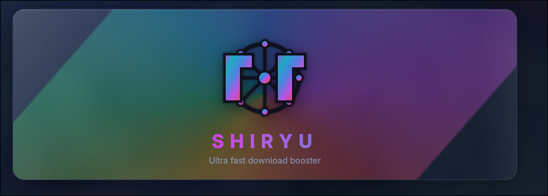
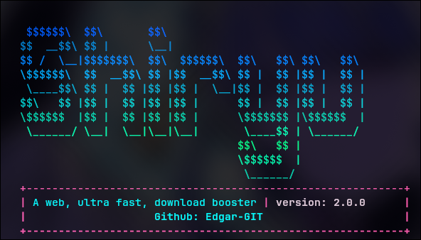

# Shiryu

**A lightweight, ultra-fast web download speed booster.**

Shiryu accelerates file downloads from the web using multi-threaded HTTP range requests, real-time progress tracking, integrity verification, and corruption recovery. It ships in three flavors: a **CLI** for the terminal, a **GUI** that runs in your browser, and a native **desktop app**.

Repository: [https://github.com/Edgar-GIT/Shiryu](https://github.com/Edgar-GIT/Shiryu)

---

## Screenshots

### GUI — Web interface



The GUI provides a visual download experience with a rainbow glass banner, live progress, download controls, and statistics dashboards.

### CLI — Terminal interface



The CLI offers the same core engine with an interactive terminal UI, including pause/resume, restart, stop, and integrity reporting.

---

## What is Shiryu?

Shiryu is a download booster designed to fetch large files from the internet as fast as your connection allows. When the remote server supports HTTP `Range` requests, Shiryu splits the file into multiple parts and downloads them in parallel, then merges them into a single output file.

### Key features

- **Multi-threaded downloads** — parallel workers for faster throughput on range-capable servers
- **Live progress** — percentage, speed, elapsed time, and ETA
- **Download controls** — pause, resume, restart, and stop at any time
- **Corruption handling** — detect incomplete parts and choose to restart fully or resume from the corrupted offset
- **Integrity & trust scoring** — SHA-256 checksum verification with integrity and confidence percentages
- **Session logging** — per-download logs saved under `target/`
- **Cross-platform** — Windows, macOS, and Linux
- **Three interfaces** — CLI, browser GUI, and native desktop app
- **Minimal dependencies** — core engine uses Go standard library only

---

## Technologies

| Layer | Technology |
|-------|------------|
| Core language | **Go 1.26+** |
| Download engine | Go `net/http` with ranged parallel requests |
| Integrity | Go `crypto/sha256` |
| CLI UI | Terminal ANSI colors, interactive stdin input |
| GUI | Embedded HTTP server + HTML/CSS/JavaScript (SSE for live updates) |
| Desktop App | Native window via WebView (`APP_VERSION/`) |
| Shared UI | `pkg/ui/` — rainbow glass banner, charts, animal progress track |
| Low-level tools | **Zig** + **C** (optional standalone utilities under `CLI_VERSION/src/zig/`) |
| Shared utilities | `UTILS/` — formatting, terminal helpers, input routing |

---

## Project structure

```
Shiryu/
├── CLI_VERSION/          # Terminal application
│   ├── main.go
│   └── src/go/
│       ├── core.go           # Main loop & session flow
│       ├── download/           # Parallel download manager
│       ├── integrity/          # SHA-256 & trust assessment
│       ├── ui/                 # Terminal display & logging
│       └── utils/              # Network & file helpers
├── GUI_VERSION/          # Browser-based application
│   ├── main.go
│   └── server/               # REST API + SSE backend
├── APP_VERSION/          # Native desktop application
│   └── main.go               # WebView window (no browser)
├── pkg/ui/               # Shared web frontend (GUI + App)
│   └── static/               # HTML, CSS, JS
├── UTILS/                # Shared helpers (CLI + common)
├── target/               # Download output (created at runtime)
├── main.png              # GUI screenshot
└── main2.png             # CLI screenshot
```

---

## Requirements

- **Go 1.26 or newer** — [https://go.dev/dl/](https://go.dev/dl/)
- **Git** — to clone the repository
- A terminal (for CLI) or a web browser (for GUI)

No other dependencies are required to build or run Shiryu.

---

## Installation & usage

### Step 1 — Install Go

#### Windows

1. Download the Windows installer (`.msi`) from [https://go.dev/dl/](https://go.dev/dl/).
2. Run the installer and follow the prompts.
3. Open **Command Prompt** or **PowerShell** and verify:

   ```bash
   go version
   ```

#### macOS

**Option A — Official installer**

1. Download the macOS package (`.pkg`) from [https://go.dev/dl/](https://go.dev/dl/).
2. Run the installer.
3. Open **Terminal** and verify:

   ```bash
   go version
   ```

**Option B — Homebrew**

```bash
brew install go
go version
```

#### Linux

**Debian / Ubuntu**

```bash
sudo apt update
sudo apt install golang-go git
go version
```

**Arch Linux**

```bash
sudo pacman -S go git
go version
```

**Fedora**

```bash
sudo dnf install golang git
go version
```

> For the latest Go version on Linux, use the official tarball from [https://go.dev/dl/](https://go.dev/dl/) and add it to your `PATH`.

---

### Step 2 — Clone the repository

Open a terminal and run:

```bash
git clone https://github.com/Edgar-GIT/Shiryu.git
cd Shiryu
```

---

### Step 3 — Build

From the project root (`Shiryu/`):

#### CLI

```bash
go build -o shiryu_cli ./CLI_VERSION/
```

| Platform | Output binary |
|----------|---------------|
| Windows  | `shiryu_cli.exe` |
| macOS / Linux | `shiryu_cli` |

#### GUI

```bash
go build -o shiryu_gui ./GUI_VERSION/
```

| Platform | Output binary |
|----------|---------------|
| Windows  | `shiryu_gui.exe` |
| macOS / Linux | `shiryu_gui` |

#### Desktop App

Requires **WebView** runtime and build tools:

| Platform | Requirements |
|----------|--------------|
| Windows | [WebView2](https://developer.microsoft.com/en-us/microsoft-edge/webview2/) (pre-installed on Windows 11) |
| macOS | WKWebView (built-in) |
| Linux | `webkit2gtk` — e.g. `sudo apt install libwebkit2gtk-4.1-dev` (Debian/Ubuntu) or `sudo pacman -S webkit2gtk` (Arch) |

```bash
go build -o shiryu_app ./APP_VERSION/
```

| Platform | Output binary |
|----------|---------------|
| Windows  | `shiryu_app.exe` |
| macOS / Linux | `shiryu_app` |

---

### Step 4 — Run

#### CLI (terminal)

**Windows (PowerShell / CMD)**

```bash
.\shiryu_cli.exe
```

**macOS / Linux**

```bash
./shiryu_cli
```

**Without building (development)**

```bash
go run ./CLI_VERSION/
```

#### GUI (browser)

**Windows**

```bash
.\shiryu_gui.exe
```

**macOS / Linux**

```bash
./shiryu_gui
```

**Without building**

```bash
go run ./GUI_VERSION/
```

#### Desktop App (native window)

**Windows**

```bash
.\shiryu_app.exe
```

**macOS / Linux**

```bash
./shiryu_app
```

**Without building**

```bash
go run ./APP_VERSION/
```

Opens a native desktop window — no browser tab needed.

The GUI starts a local server and opens your default browser automatically. The URL is printed in the terminal (e.g. `http://127.0.0.1:54321`).

---

## How to use

### CLI

1. Enter a download URL when prompted.
2. Choose whether to use multi-threading (if the server supports it).
3. Optionally enable integrity check and provide a SHA-256 checksum.
4. During the download, type commands:
   - `pause` — pause the download
   - `continue` — resume
   - `restart` — delete progress and start over
   - `stop` — cancel and return to the menu
5. After completion, view **Integrity** and **Trust** percentages.
6. Type `exit` to quit or press Enter to return to the menu.

### GUI

1. Open the **Home** tab and paste a download URL.
2. Wait for metadata validation — the **Start Download** button activates when the URL is valid.
3. Configure options (multi-thread, integrity check, clear target folder).
4. Click **Start Download** — you are taken to the live progress page.
5. Use **Pause**, **Continue**, **Restart**, or **Stop** as needed.
6. On completion, review integrity and trust scores.
7. Open the **Stats** tab for speed gauges and download history charts.

### Output location

All downloads are saved under:

```
./target/<timestamp>/
```

Each session includes the downloaded file, `download.log`, and `downloader.log`.

---

## License

This project is licensed under the **MIT License**. See [LICENSE](LICENSE) for details.

---

## Author

**Edgar-GIT** — [https://github.com/Edgar-GIT](https://github.com/Edgar-GIT)
